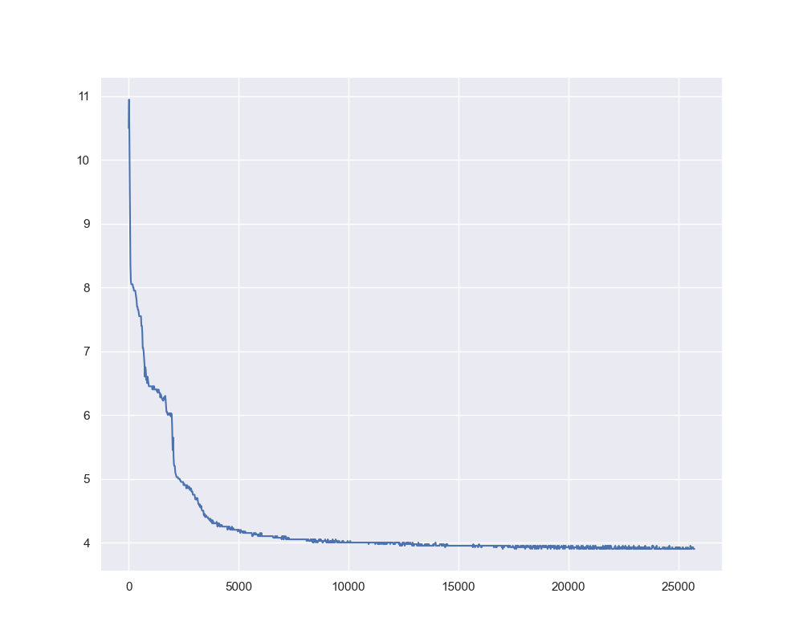
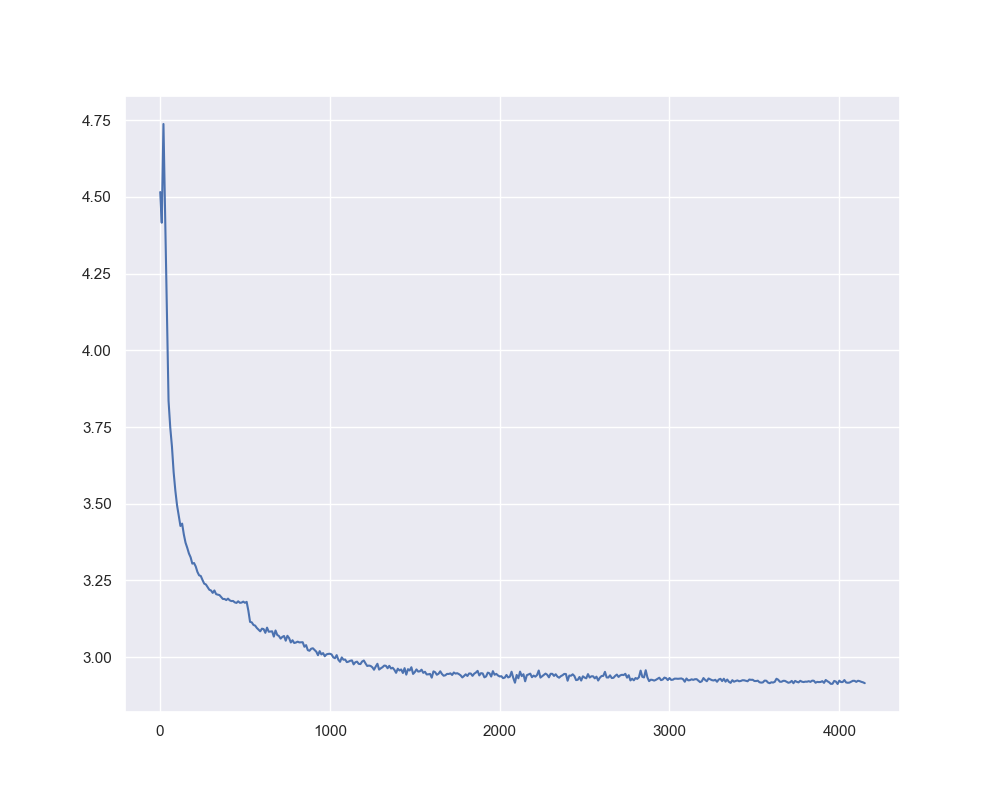
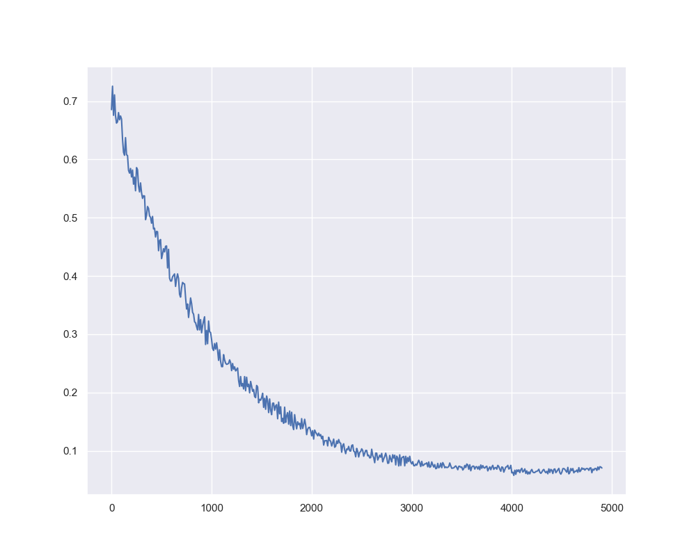

<div align="center">

# Mini Chinese Phi3

</div>


# 介绍

Mini-Chinese-Phi3是一个基于phi3模型结构的小型对话模型，总参数量约0.13B，使用常见的中文语料进行预训练和微调。主要内容包括了
- 数据集的整理与简单清洗
- 中文词表预训练
- 基于phi3结构的模型预训练
- 基于预训练模型的指令微调（SFT），包括了全量微调和LoRA微调
- 基于指令微调模型的直接偏好优化（DPO）
- 模型评测 **（待做）**

项目中的所有训练过程均在两张3090显卡上进行，使用DeepSpeed框架和Flash Attention 2进行加速，预训练用时约40小时，SFT和DPO微调共用时约8小时。本项目是我在学习LLM过程中的一个简单实践，同时也希望能够帮助到同样初学大模型的小伙伴。

模型参数现已开源，开放模型权重以供下载。项目地址：[Mini-Chinese-Phi3](https://huggingface.co/niwz/Mini-Chinese-Phi3)，可以通过`tokenizer = AutoTokenizer.from_pretrained("niwz/Mini-Chinese-Phi3")`和`model = AutoModelForCausalLM.from_pretrained("niwz/Mini-Chinese-Phi3")`直接加载模型参数。


# 目录结构

```
MiniChinesePhi3
├── datasets
│   ├── train_data_files
│   └── eval_data_files
├── pretrain
│   ├── pretrained_model_files
│   └── tokenizer_files
├── fine_tuned
│   ├── sft
|   |   ├── sft_model_files
|   |   └── tokenizer_files
│   └── dpo
|       ├── dpo_model_files
|       └── tokenizer_files
└── files_list_here
```

# 模型结构及训练过程

## 模型结构

本项目采用的参考模型结构是phi3，具体细节请参考原始论文：[Phi-3 Technical Report: A Highly Capable Language Model Locally on Your Phone
](https://arxiv.org/abs/2404.14219)。
原计划将Phi3中的RoPE替换为最近发布的[CoPE](https://arxiv.org/abs/2405.18719)，但由于CoPE目前难以使用Flash Attention进行加速，因此Mini-Chinese-Phi3仍然使用了Phi3的RoPE。另一方面，参考GPT-2的参数规模，Mini-Chinese-Phi3的隐藏层维度为768，层数为12，词表数量为32000(SFT阶段调整为32064)，总参数量约0.13B。


## Tokenizer训练

   Wiki中文百科：[wikipedia-cn-20230720-filtered](https://huggingface.co/datasets/pleisto/wikipedia-cn-20230720-filtered) 

## 预训练

   天工数据集：https://huggingface.co/datasets/Skywork/SkyPile-150B/tree/main/data

注：受到硬件设备和精力限制，仅使用了天工数据集前10个文件进行预训练。

使用方式：
```bash
bash pretrain.sh
```
以下是预训练数据集中的一个样本：
```data
   'text': '作为钢格板焊接时填充金属或同时作为导电用的金属丝焊接材料.在气焊和钨极气体保护电时焊丝用作填充金属;在埋弧焊、电渣焊和其他熔化极气体保护电弧焊时焊丝既是填充金属同时也是导电电极.焊丝可分为3类.焊丝的表面不涂防氧化作用的焊剂.\n大多数用于钢格板的焊丝属于此类包括碳钢焊丝、低合金结构钢焊丝、合金结构钢焊丝、不锈钢丝和有色金属焊丝等.\n有些合金如钴铬钨合金不能锻、轧和拔丝而用铸造方法制成.它主要用于钢格板表面的手工堆焊以满足如抗氧化、耐磨损和高温下耐腐蚀等特殊性能要求.采用连续浇注和液态挤压可制造出长达数米的钴铬钨焊丝用于自动填丝钨极气体保护电弧焊以提高焊接效率和堆焊层质量同时还能改善劳动条件.钢格板补焊有时也采用铸造焊丝.\n用薄钢带卷成圆形或异形钢管内填一定成分的药粉经拉制成的有缝药芯焊丝或用钢管填满药粉拉制成的无缝药芯焊丝用这种焊丝焊接熔敷效率高对钢格板适应性好试制周期短因而它的使用量和使用范围不断扩大.这种焊丝主要用于二氧化碳气体保护焊、埋弧焊和电渣焊.药芯焊丝中的药粉成分一般与焊条药皮相似.含有造渣、造气和稳弧成分的药芯焊丝焊接时不需要保护气体称自保护药芯焊丝适用于焊接钢格板.'
```


预训练过程中的Loss曲线如下：


## SFT微调

SFT数据集使用了BelleGroup的指令数据集，包含约300万条中文指令数据。
- https://huggingface.co/datasets/BelleGroup/train_2M_CN
- https://huggingface.co/datasets/BelleGroup/train_1M_CN

在SFT阶段，由于聊天模板的缘故，引入了一些新的特殊token，为了使预训练模型能够适应这些特殊token，因此首先使用了5%的数据进行全量微调。

使用方式：
```bash
bash sft.sh
```
以下是构造的数据集中的一个样本：
```data
'instruction': '[user]\n请根据以下问题，回答问题与提供啤酒酿造的基础知识：啤酒是如何酿造的？[end]\n[assistant]',

 'output': '啤酒是由麦芽、酵母、水和啤酒花（Humulus Lupulus）等原料制成的酒类饮料。在酿造过程中，这些原料被混合在一起，经过发酵和瓶装处理而成。以下是啤酒的基础酿造过程：\n1. 磨碎麦芽\n麦芽是小麦或大麦籽粒在水中浸泡并使其发芽，然后烤干。在酿造啤酒时，麦芽用淀粉酶来把淀粉质分解成麦汁中的可发酵糖分。麦芽需要磨碎成较小的颗粒，以便于后续的酿造过程。\n2. 借助热水解淀粉\n接下来，磨碎的麦芽被加入到一些热水中。这个过程称为热水解淀粉，目的是通过淀粉酶酶解淀粉在糊化过程中产生麦芽糊化酵素，将淀粉糊化产生出大量糖类。这个过程将产生一种叫作麦汁的液体，麦汁会在接下来的发酵过程中转化成啤酒。\n3. 加入啤酒花\n在煮沸后，麦汁中添加啤酒花。这里啤酒花的作用是增加啤酒的香气和苦味，同时也防止了麦汁中的细菌滋生。煮沸需要持续时间约为一个小时，使得啤酒花中的黄酮类化合物溶于麦汁中，从而为啤酒提供独特的味道。\n4. 冷却和调整\n酿造过程中，麦汁必须冷却到正确的温度，这通常需要使用冰水或降温设备。麦汁冷却后，就可以把酵母加入到其中进行发酵。酵母会用可发酵糖分来产生二氧化碳和酒精。根据啤酒类型的不同，该麦汁需要进行一些不同调整。例如，淡啤酒需要加入一些麦芽糖以增加其酒精度，而黑啤酒需要加入一些黑麦芽以增加其香气。\n5. 发酵和成熟\n当酵母被加入麦汁中时，它们开始进行发酵，并转化可发酵糖成酒精和碳酸气体。发酵过程通常需要进行大约一周，而在此时间内，啤酒将需要保持在恒定的温度下。一旦发酵完成，啤酒还需要在更低的温度下继续陈酿一段时间。这个过程称为成熟，它可以让啤酒变得更平衡、甜美和更加光滑。 \n6. 瓶装和储存\n最后一步是将啤酒瓶装储存，当然在瓶装啤酒之前，瓶子和瓶盖需要进行彻底的清洁和消毒处理。瓶装后还需在适当的温度下储存啤酒，一些啤酒可能需要在冷藏条件下使用，以保持其最佳口感。 \n综上所述，啤酒的酿造是一个复杂的过程，需要仔细选择好各种原料并遵循正确的酿造过程。各自的类型也会有不同的酿造方法。整个过程需要时间和耐心，以确保生产出美味的啤酒。[EOS]'
```

SFT微调过程的Loss曲线如下：


## DPO微调

本项目DPO数据集中的`chosen`文本来自alpaca数据集[alpaca-gpt4-data-zh](https://huggingface.co/datasets/c-s-ale/alpaca-gpt4-data-zh)，拒绝文本`rejected`来自SFT微调模型的输出，共计约5万条数据。生成DPO数据集时建议使用vLLM进行推理加速，否则生成速度会很慢。

使用方式：
```bash
bash dpo.sh
```
以下是构造的数据集中的一个样本：
```data
'prompt': '[user]\n讨论大萧条的原因[end]\n[assistant]'

'chosen': '大萧条是20世纪初期发生在全球范围内的经济衰退现象，其中最为严重的地区当属美国。这场经济危机持续了近十年之久，它的起因较为复杂，涉及多方面因素。首先，我们要提到1929年的股市崩盘。股票价格大幅下跌，导致投资者损失惨重，进而影响了消费信心。其次，当时的金融政策也是一个重要因素。为了维持金本位制度，联邦储备系统采取紧缩政策，却进一步加剧了资金短缺的问题。此外，当时政府对失业率的应对不力，社会保障制度不健全，也为经济衰退的进一步恶化埋下了祸根。最后，国际贸易也受到了影响。由于当时许多国家采取贸易保护主义政策，全球贸易额大幅下降，给各国经济造成了巨大冲击。综上所述，大萧条的原因是多方面的，涉及到金融政策，国际贸易，社会保障制度等多个领域。它给全球经济发展带来了严重的挑战，也为我们提供了深刻的历史经验教训。'

'rejected': '大萧条是一个非常重要的事件，因为大萧条的原因是由于全球气候变化，包括大气、水、土地和水污染，以及气候、水、土地和水源等。而在全球变暖、极端天气等极端天气事件中，大萧条的原因是气候变化。因此，应对气候变化是一个非常重要的议题，因为全球变暖和极端天气事件都可能引发大气、水、土地和水源等极端天气事件的发生。除了上述探讨，各国政府也对气候变化的看法都提出了明确的意见和建议。首先，各国政府应该采取措施来减轻气候变化的影响。例如，各国政府可以在5年内采取措施来减少温室气体排放，以减少温室气体的排放。其次，各国政府应该采取措施来减缓气候变化的影响，例如增加使用可再生能源。最后，各国政府应该采取措施来减缓气候变化的影响。例如，政府可以采取措施来减缓气候变化的影响，从而减少温室气体的排放。这些措施可以减轻气候和能源紧张感，从而可以减缓气候变化的影响。此外，政府也应该采取措施来减少温室气体排放，如减少排放气体，以降低全球气候状况。总之，经济是可持续发展的基础。在当今大萧条，人们必须采取措施来减缓气候变化的影响。我们需要团结和共处，以确保我们能够创造一个更加健康、环保、高效和可持续的未来。'
```
DPO微调过程的Loss曲线如下：



# 参考

本项目主要参考了以下项目：
- [ChatLM-mini-Chinese](https://github.com/charent/ChatLM-mini-Chinese)
- [MINI_LLM](https://github.com/jiahe7ay/MINI_LLM)
- [llm-course](https://github.com/mlabonne/llm-course)